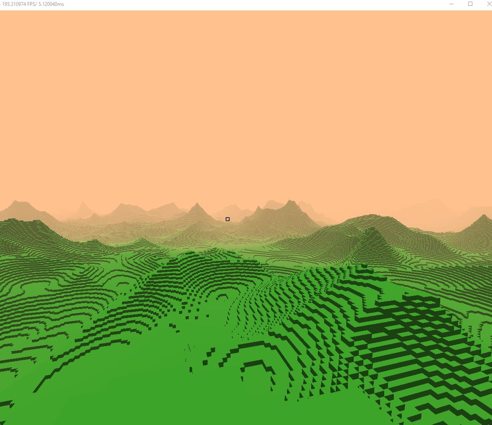

# RVox Engine 
A Voxel Engine made from scratch using OpenGL

## Procedural Generation
 

## Optimizations   
- World is made up of chunks 
- Each chunk is meshed before hand 
- Interior voxels are culled for performance 
- Chunks are culled when out of frustum 
  
## Lighting 
- Basic rudimentary lighting which is calculated using the normals of each voxel  
- Fog 

## Model Loading 
   
 
