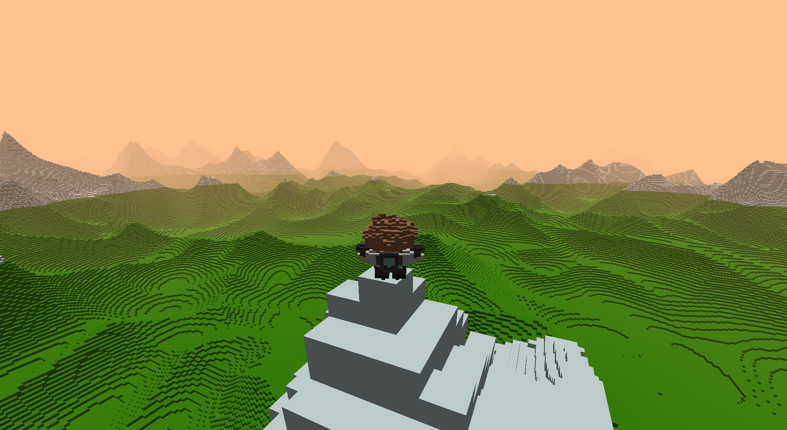

# RVox Engine 
A Voxel Engine made from scratch using OpenGL

  

## Procedural Infinite Generation
 

## Optimizations   
- World is made up of chunks 
- Each chunk is meshed before hand 
- Interior voxels are culled for performance 
- Chunks are culled when out of frustum 
  
## Lighting 
- Basic rudimentary lighting which is calculated using the normals of each voxel  
- Fog 

## Physics 
- AABB vs AABB collisions  
- One block height auto jump 

## Other 
- First person camera 
- 3rd person camera 
- Orthographic camera 

## Model Loading 
   
 
