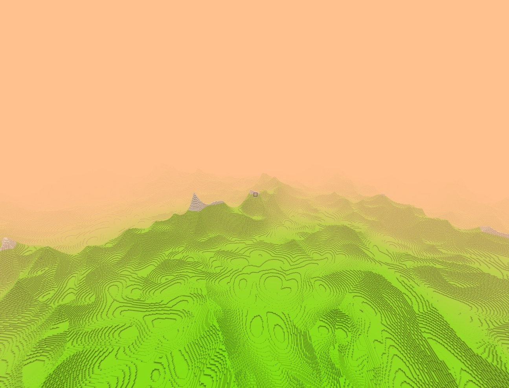
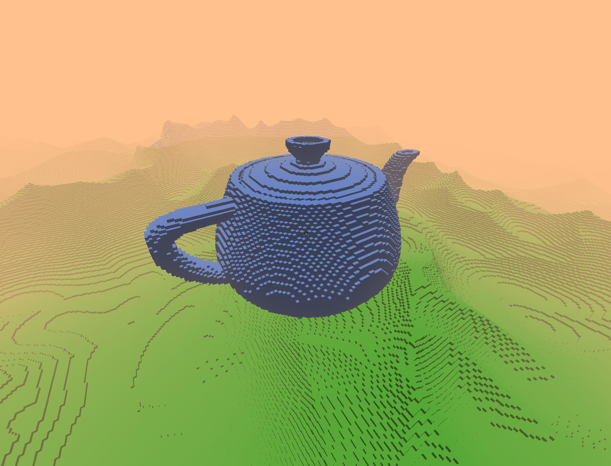

# RVox Engine 

  

A Voxel Engine made from scratch using OpenGL

## Procedural Infinite Generation
-  

## Optimizations   
- World is split up into 32x256x32 chunks
- Each chunk has its own mesh where voxel faces not surrounded by air are culled  
- Chunks are culled when out of frustum 
- Meshing and chunk generation is multithreaded using std::async  
  
## Lighting 
- Basic rudimentary lighting which is calculated using the normals of each voxel  
- Fog 
- Shadow Mapping using depth buffer pass 
- Voxel Ambient Occlusion 

## Physics 
- AABB vs AABB collisions  
- One block height auto jump 

## Other 
- First person camera 
- 3rd person camera 
- Orthographic camera 

## Model Loading 
-    
-  

## Libraries Used 
- <a src="https://github.com/Auburn/FastNoiseLite">FastNoiseLite</a> - Procedural terrain  generation 
- <a src="https://github.com/nothings/stb/blob/master/stb_image.h">stb_image</a> - Image loading for textures  
- <a src="https://github.com/nmwsharp/happly">happly</a> - Parsing .ply files for model loading 
- <a src="https://glad.dav1d.de/">GLAD</a> - OpenGL  functionality  
- <a src="https://github.com/g-truc/glm">GLM</a> - Math library for OpenGL use 
- <a src="https://www.glfw.org/">GLFW</a> - Window management